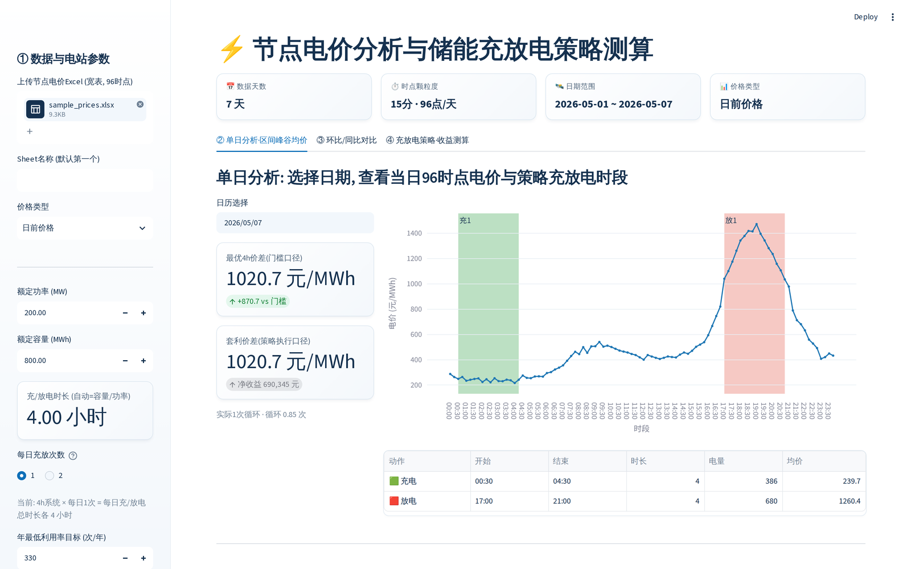
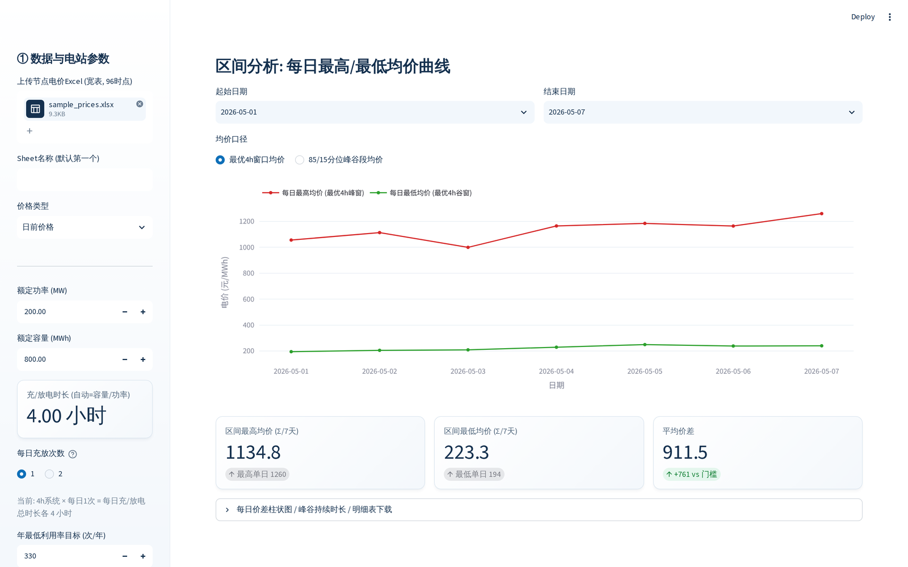
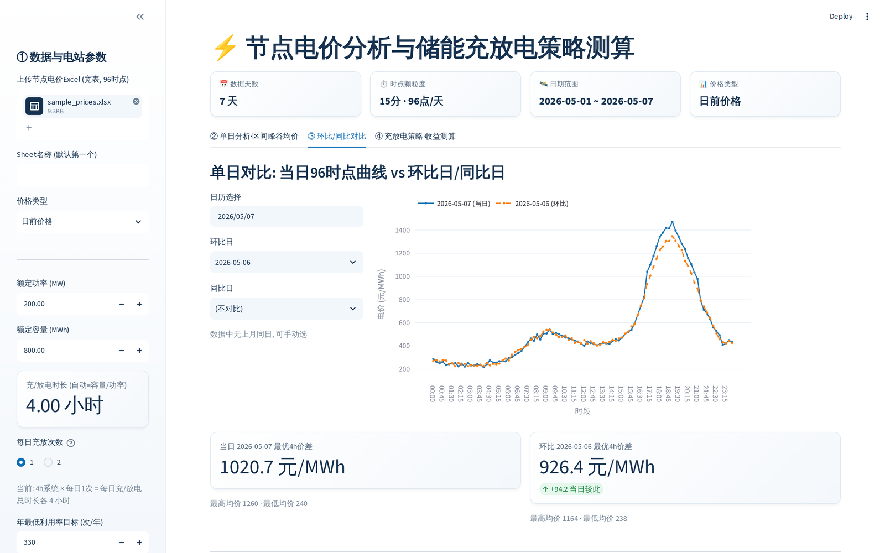
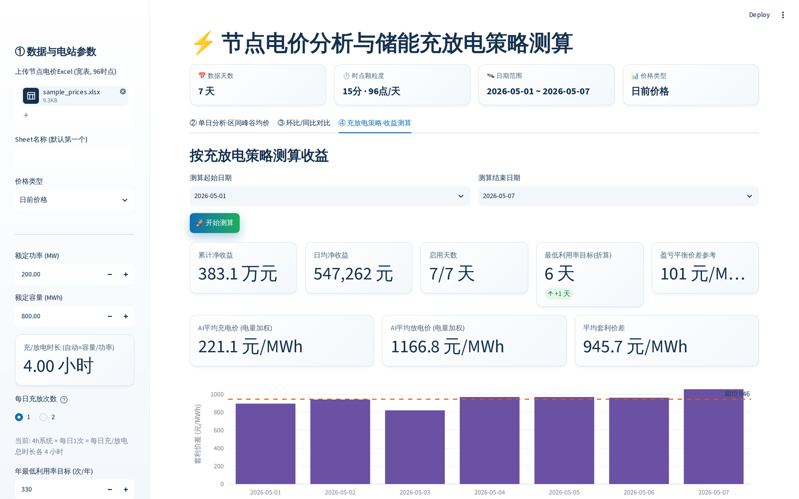
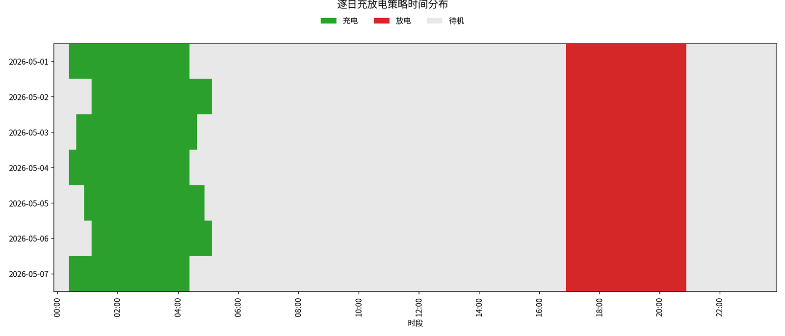
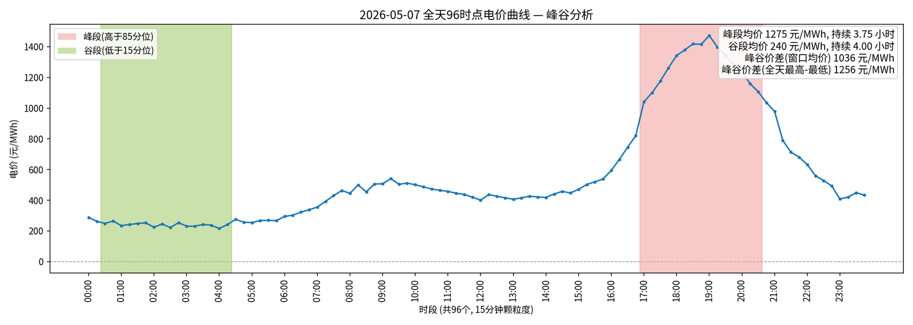

# 储能电价分析与充放电策略测算工具

面向电力现货市场独立储能电站的峰谷套利分析与收益测算工具。输入一段时间的节点电价数据（96 时点 / 15 分钟颗粒度），工具自动分析每日峰谷价格特征，按贴近实际运行的充放电策略规则逐日求解最优充放电方案（MILP 优化），并测算这段时间的套利收益。

工具在本地电脑运行，数据不出本机；提供网页交互式界面，也支持命令行批量回测。

## 界面预览

> 以下截图均由仓库内置的示例数据 `data/sample_prices.xlsx` 直接跑出，克隆下来即可复现。

### 网页版

**单日分析** —— 选定某天查看 96 时点电价曲线，绿色/红色色块是 MILP 求解出的实际充电/放电时段，右侧表格给出每段的时长、电量与均价：



**区间峰谷均价** —— 每日最高/最低均价趋势，支持「最优 Nh 窗口均价」与「85/15 分位峰谷段均价」两种口径切换：



**环比 / 同比对比** —— 当日曲线叠加环比日（前一日）与同比日（上月同日），并对比各自价差：



**收益测算** —— 逐日 MILP 求解后给出累计/日均净收益、启用天数与利用率目标对比、盈亏平衡价差、电量加权的实际套利价差，结果可导出 CSV：



### 命令行批量回测

除了网页版，`python scripts/station_analysis.py` 会把图表自动归档到 `output/`：

**逐日充放电策略时间分布热力图** —— 一眼看出策略在什么时段充、什么时段放，以及哪些天待机：



**单日峰谷分析图** —— 标注峰段（>85 分位）/ 谷段（<15 分位）窗口及其均价、持续时长与价差：



## 目录结构

| 路径 | 说明 |
| --- | --- |
| `scripts/` | 程序脚本 |
| `scripts/battery_arbitrage.py` | 命令行入口 / 工具函数（电池参数、数据加载、单日演示；求解走 `station_analysis.py` 严格引擎） |
| `scripts/station_analysis.py` | 严格 MILP 引擎 + 命令行回测（结果自动存到 `output/`） |
| `scripts/price_trading_app.py` | 交互式网页版（推荐） |
| `scripts/generate_sample_data.py` | 生成示例电价 Excel（写到 `data/sample_prices.xlsx`） |
| `data/` | 电价 Excel 数据（已含示例 `sample_prices.xlsx`） |
| `output/` | 命令行回测结果输出目录（CSV / PNG / HTML 自动归档到这里） |
| `docs/` | 图文版使用说明（.docx，含界面逐页操作说明）+ README 用截图 |
| `python-installer/` | Python 安装程序下载说明 |
| `requirements.txt` | 依赖清单 |
| `*.bat` | Windows 一键脚本（见下） |
| `packages/` | **不在仓库内**，离线依赖包需另行获取，见下方「离线安装」 |

## 快速开始

### Windows（推荐用打包好的一键脚本）

1. 安装 Python：若电脑未装 Python，按 `python-installer/下载说明.txt` 指引下载 Python 3.12（64 位）并安装，**务必勾选 "Add Python to PATH"**。
2. 安装依赖：
   - 能上网：双击 `1-Install-Online.bat`
   - 内网 / 断网：双击 `2-Install-Offline.bat`（依赖 `packages/` 目录，见下方离线安装说明）
3. 启动网页版：双击 `3-Start-App.bat`，浏览器自动打开（默认 `http://localhost:8501`）。
4. 命令行批量回测：双击 `4-Run-Backtest.bat`，默认直接跑通内置示例数据，结果存到 `output/`。
5. 卸载：双击 `9-Uninstall.bat`，分两步确认（先问要不要卸载依赖包，再问要不要删除整个文件夹）。

### macOS / Linux（或不想用 .bat 的 Windows 用户）

核心 Python 脚本本身是跨平台的（中文字体已适配 Windows / macOS / Linux），不依赖 `.bat`：

```bash
pip install -r requirements.txt
python scripts/generate_sample_data.py   # 可选：重新生成示例电价数据
streamlit run scripts/price_trading_app.py   # 网页版
python scripts/station_analysis.py           # 命令行批量回测
```

### 离线安装（无网络环境）

`packages/` 目录未随仓库提交（约 115MB，52 个 whl 文件，不适合放进 Git 历史）。如需离线安装：

1. 从本项目 [Releases](../../releases) 页面下载离线依赖包 `packages.zip`（如尚未发布，可自行在联网环境执行 `pip download -r requirements.txt -d packages` 生成）。
2. 解压到项目根目录的 `packages/` 文件夹。
3. 双击 `2-Install-Offline.bat`（离线包按 Python 3.12 / Windows 64 位下载，其他版本请用在线安装）。

## 数据格式要求

`data/` 文件夹里的 Excel，宽表格式：

- 每行代表一天，列依次为：类型（日前价格 / 实时价格，可选）、日期、`00:00`、`00:15`、……、`23:45`，共 96 个时间列（15 分钟颗粒度）。
- 支持日前 / 实时价格共存于同一张表，用"类型"列区分。
- 可参照 `data/sample_prices.xlsx` 示例文件整理格式。

## 策略口径备忘

- 系统时长 N = 容量 / 功率，自动识别两种模式：
  - 4 小时系统（如 200MW / 800MWh）：每日 1 充 1 放，年目标默认 330 次
  - 2 小时系统（如 200MW / 400MWh）：每日 2 充 2 放，年目标默认 660 次（界面"每日充放次数"可手动改）
- 每启用日充电总时长 = 放电总时长 = N × 每日次数（硬约束）
- 每日 2 次循环时启用严格交替：充 1 → 放 1 → 充 2 → 放 2，每块恰好 N 小时连续，不允许连续两次充电
- 第二循环规则（2h 系统）：第二循环价差（放电均价 − 充电均价）< 200 元/MWh 时，当日自动放弃第二循环（默认只做一充一放；界面可切换为"只做低价充电留到次日"）；200 阈值界面可调
- 区间"最高 / 最低均价"口径 = 每日均价求和 / 天数（区间日均，非区间极值）
- 启用双门槛：最优 N 小时窗口峰谷价差 ≥ 150 元/MWh 且 完整充放净收益 > 0
- 年 330 次默认为最低利用率目标（下限），不强行凑数，缺口会提示；如需按电池质保 / 年度预算设**硬上限**，见下方「年度循环上限」
- SOC 跨天连续传递；往返效率默认 87%（可调）；峰谷段识别带 1 点容差
- 套利价差（策略实际执行口径）= 放电均价 − 充电均价（电量加权）

## 关键假设与可调参数

以下三项直接决定「某一天到底启不启用」的判断结果，换电池 / 换项目时务必重新核实，不要沿用默认值：

| 参数 | 默认值 | 在哪里改 | 说明 |
| --- | --- | --- | --- |
| 电池损耗成本 | 60 元/MWh 放电 | 网页版侧边栏 / CLI `--degradation_cost` / 常量 `DEGRADATION_COST_PER_MWH` | **经验值，无公式支撑**。更严谨的估法：`电池 Capex ÷ (循环寿命 × 放电深度)`。按不同口径估算可能相差数倍（可变运维口径仅 2–5 元/MWh，Capex 摊销口径可达 100+ 元/MWh），直接影响盈亏判断 |
| 往返效率 | 87% | 网页版侧边栏 / CLI `--round_trip_eff` / 常量 `ROUND_TRIP_EFF` | 单向效率取 √(往返效率)，充放各一半 |
| 年度循环上限 | 不限制 | 网页版侧边栏勾选 / CLI `--cycle_cap` / 常量 `ANNUAL_CYCLE_CAP` | **默认关闭**：只要过价差门槛且当日盈利就启用，不设上限。开启后会把所有候选日按估算净收益排序，只保留收益最高的 N 天，其余即使自己盈利也让位待机（对应电池质保 / 年度循环预算是硬约束的场景） |

## 已知限制

- **逐日独立求解**：每天的 MILP 独立求解、仅靠 SOC 跨天串联，不是全年联合最优。开启年度循环上限时会先按估算收益排序择优，但仍非严格全局最优解。
- **充放窗口不跨零点**：按自然日切片求解，横跨午夜的连续低谷（如 23:00–次日 02:00）会被日边界切断。
- **仅现货峰谷套利收益**：不含容量电价 / 容量补偿、辅助服务等其他收益渠道，用于投资测算时收益会偏保守。
- **第二循环规则为事后启发式**：先按两循环求解、再检查价差决定是否回退重解，不是模型内的联合最优决策（也是 2h 系统求解偏慢的原因）。

## License

本项目基于 [MIT License](LICENSE) 开源。
